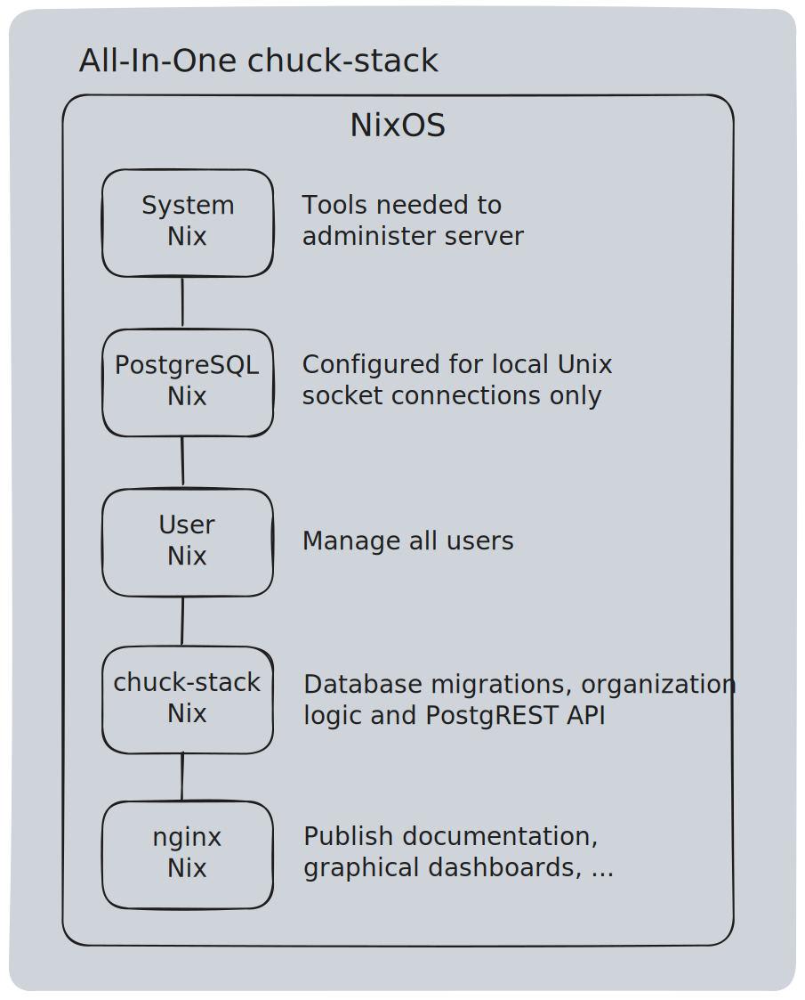

# chuck-stack Architecture

In the [introduction](./introduction.md), we state the chuck-stack is a collection of:

1. [well understood tools](./stack-tools.md)
1. [organization best practices](./best-practices.md)
1. [application framework](./stack-application.md)

The purpose of this page is to help you understand how the these tools fit together in deployment and usage. If you want to see the architecture in action, view the [picture of success](./picture-success.md#how-is-this-possible). 

The chuck-stack architecture is designed around an organization only hiring two talents in its IT department:

1. Linux
1. PostgreSQL

Both talents will become proficient in AI in their respective disciplines. Both talents are optimized to help [superclerks](./terminology.md#superclerk) automate their own roles (self-help).

## TOC

<!-- toc -->

## Configuration Over Code

One common theme you will find throughout the chuck-stack is the desire for configuration over code. This is true for both Linux and PostgreSQL. Inspecting the chuck-stack deployment highlights the extent of configuration. What little code that does exist comes in the form of high-value, human-readable work instructions and SQL DDL.

Actions to deploy the chuck-stack:
- System configuration (NixOS)
- Role configuration (nix-shell)
- PostgreSQL configuration (SQL DDL)
- Work Instructions (plain text)

### NixOS

Before we discuss NixOS, you should know a little about the [Nix package management](./tool-linux.md#nix) tool. 

The chuck-stack uses NixOS to deploy server applications because of its ability to simply describe the tools and configuration needed. Nix takes care of the deployment for us. This concept is true the day we deploy and anytime we perform maintenance thereafter. You simply declare what you want, and Nix makes that configuration come into existence.

Here are the [chuck-stack NixOS repository configurations](https://github.com/chuckstack/chuck-stack-nix/tree/main/nixos).

Below is a diagram illustrating how you can simply add a NixOS configuration file to a server to create and configure important services.

diagram: nixos TODO

### nix-shell

The chuck-stack uses nix-shell to apply the proper role tools and configuration to the right users. Said another way, when a user connects to the chuck-stack, nix-shell applies all assigned roles and ensures the environment is configured so that the user can fulfill the role's duties.

Just like NixOS, nix-shell is configuration based. Here is a sample [nix.shell](https://github.com/chuckstack/chuck-stack-nix/blob/main/nix-shell/postgresql-local/shell.nix) that installs and configures PostgreSQL. <!--TODO: need a better example that focuses on a role--> 

Here is a diagram showing how we use nix-shell.

diagram: nix-shell TODO

It is worth noting that both chuck-stack users and developers use nix-shell to perform their respective roles. While these role's tasks and tools may differ, we deliver the role work instructions and tools in the exact same way to all roles. This is an important point, and it differentiates the chuck-stack from its historical alternatives.

Here is an example of how a developer can use nix-shell to [test a SQL migration](https://github.com/chuckstack/stk-app-sql/blob/main/test/shell.nix) in a matter of seconds.

### PostgreSQL

The chuck-stack uses [PostgreSQL](./tool-postgresql.md) to manage data, users, roles, records, workflows, attributes, documents, and more... 

SQL is one of the most expressive and well-known data and data-access standards in the world. The chuck-stack creates simplicity by moving almost all application configuration and logic into the database, and using PostgreSQL where it excels the most. We challenge you to find a more popular, better documented, more capable, and more secure user/role system (other than Linux itself).

The chuck-stack uses the tight integration between Linux (NixOS), PostgreSQL and Git to describe application deployment and operation. The below [Administration Experience](#administration-experience) sections highlights a common workflow using these tools.

By maximizing the features that make PostgreSQL great, we minimize the skills (and thereby experts) needed to make changes to your organization's system. You can find more information about [how we use PostgreSQL here](./success-postgresql.md). If you want a lot more information, see the [PostgreSQL Conventions](./postgres-conventions.md) page.

Diagram: TODO

### Work Instructions

Described well [here](./best-practices-operation-say.md).

## User Experience

The majority of a user's experience is spent instructing the system via text or voice on what to do (much like with ChatGPT or Claude AI).

- Users connect via ssh into a remote session from any device (phone, tablet, laptop, or computer)
- The remote session is configured by a nix-shell
- The nix-shell launches [Zellij](./tool-zellij.md) with one of a couple custom layouts
- Users spend most of their time either interacting with the command line or AIChat's REPL
- Users will typically create automation to remove as many manual steps as is possible

<!-- TODO: determine how users deploy a timer/cron task -->
<!-- TODO: determine best option for new users in text documents -->
<!-- TODO: reconcile use of local tools like Obsidian -->

The user's experience is dictated by nix-shell. When a user connects, the system loads the appropriate nix-shell and makes sure the user has the tools available to execute the tasks assigned to their role(s).

## Administration Experience

[Git](./tool-git.md) plays a big role in chuck-stack administration workflows. Here is a typical scenario:

- Administrator needs to make a change - example: add a new user
- Administrator makes a change to user.nix and commits the change
- System automatically sees and deploys the updated configuration

The Git branching feature dictates what environments get updated. A change to the 'Test1' branch will deploy changes to the 'Test1' UAT environment. A change to the 'Prod' branch will update the 'Prod' environment.

The Git PR (pull request) feature plays a big role in organizations where changes need to be vetted and approved by both AI and/or humans.

## Stk Application Example

Let's review the [stk-todo-app.nix](https://github.com/chuckstack/chuck-stack-nix/blob/main/nixos/stk-todo-app.nix) example chuck-stack application configuration to better understand how the pieces come together. The stk-todo-app.nix is an example of a simple yet usable chuck-stack application.

### Two Configurations

The stk-todo-app has two configuration components:

1. [stk-todo-app.nix](https://github.com/chuckstack/chuck-stack-nix/blob/main/nixos/stk-todo-app.nix) - the nix configuration file
1. [stk-app-sql](https://github.com/chuckstack/stk-app-sql) - the database migrations repository

The [stk-todo-app.nix](https://github.com/chuckstack/chuck-stack-nix/blob/main/nixos/stk-todo-app.nix) configuration file creates a service to automatically clone and deploy the [stk-app-sql](https://github.com/chuckstack/stk-app-sql) database migrations every time the service is started.

We want to make sure you understand just how incredible this scenario is... You simply update a brand new NixOS configuration to point to a nix application file and the system will automatically install, configure and run your application. Not only during installation, but it will do this as you make changes throughout time. That is almost magical.

### Assumptions

This section assumes [system.nix](https://github.com/chuckstack/chuck-stack-nix/blob/main/nixos/system.nix) and [postgresql.nix](https://github.com/chuckstack/chuck-stack-nix/blob/main/nixos/postgresql.nix) are also deployed at the same time. Said another way, stk-todo-app depends on these services. By separating the system and the postgresql nix configurations, the stk-todo-app remains as simple and ease to understand as possible.

### SQL Migration

Since the SQL migration concept is easier to explain, let's start here first. Database migrations are held in a dedicated Git repository. The typical chuck-stack organization will make frequent additions to the SQL migration repository. The reasons to make additions to migrations include:

- Making a DDL change to either the private or api database schemas
- Adding and removing a new user or role
- Fixing an error in a SQL table
- Anything related to SQL data that needs change control and a permanent record

The chuck-stack uses sqlx-cli to manage database migrations. Notice in the below nix configuration file that Nix only creates the database and nothing else. All other database configuration responsibilities are executed by sqlx-cli. This decision was made because sqlx-cli ensures a particular migration script is executed one time.

One might argue that the user.nix should be moved to the SQL migration repository at the time of deployment so that all user and role management changes are managed in the same repository. This change is under consideration.

### Nix Configuration Review

Here is a breakdown of the [stk-todo-app.nix](https://github.com/chuckstack/chuck-stack-nix/blob/main/nixos/stk-todo-app.nix) file. Before we get into the details, let's first start with the highlights. Here is what the stk-todo-app.nix configuration does for you:

- Updates the PostgreSQL configuration to include the stk-todo-db database
- Creates a service to deploy database migrations
- Creates the [PostgREST](./tool-postgrest.md) user and service to expose an API in addition to the CLI

The first line is standard in all chuck-stack nix files.

```nix
{ config, lib, pkgs, modulesPath, ... }:
```

The 'let' block establishes variables and defaults to be used in the rest of the file.

```nix
  ...
  postgrestPort = 3000; # variable
  postgresUser = "postgrest";
  postgresDb = "stk_todo_db";
  ...

```

Included in the 'let' block is a bash script that will be deployed as a systemd service. We highlight this feature because we greatly appreciate the utility and simplicity of creating a simple bash service.

```nix
  ...
  run-migrations = pkgs.writeScriptBin "run-migrations" ''
    #!${pkgs.bash}/bin/bash
    set -e

    # Set your database URL
    export DATABASE_URL="postgres:///stk_todo_db"

    # Set the Git repository URL and the local path where it should be cloned
    REPO_URL="https://github.com/chuckstack/stk-app-sql.git"
    CLONE_PATH="/tmp/db-migrations"

    # Ensure the clone directory is empty
    rm -rf "$CLONE_PATH"

    # Clone the repository
    ${pkgs.git}/bin/git clone "$REPO_URL" "$CLONE_PATH"

    # Change to the cloned directory
    cd "$CLONE_PATH"

    # Run the migrations
    ${pkgs.sqlx-cli}/bin/sqlx migrate run

    # Clean up
    cd /
    rm -rf "$CLONE_PATH"
  '';
  ...
```

## All-In-One Server

An all-in-one server describes a deployment scenario were all tools are deployed on a single virtualized server.

### Why Consider an All-In-One 

Here are the benefits of an all-in-one deployment option:

- Least expensive
- Simplest architecture
- Most secure
- Easiest to maintain a production environment
- Easiest to create test environments

### All-In-One Architecture

The following describes a typical all-in-one deployment:

- A single virtualized server running NixOS - note this server can run anywhere in the world
- Configuration options/files are added to /etc/nixos/configuration.nix
- postgresql.nix configures PostgreSQL to hold most if not all transactional details
- user.nix maintains all users
- Users ssh to this server to gain access to tools and data

Here is a drawing representing a typical all-in-one:



