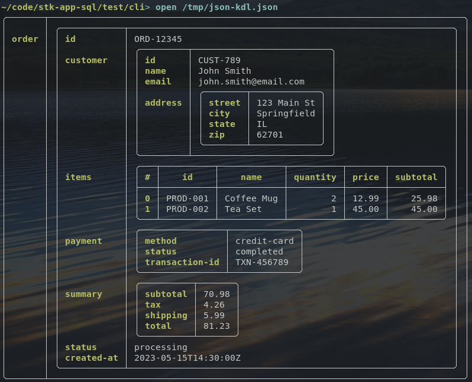

# Nushell

[Nushell](https://nushell.sh) is a Linux terminal shell that makes processing and visualizing data easier. For the chuck-stack, Nushell excels beyond others because of its preference for and usability with structured data and [data pipelines](./terminology.md#data-pipeline). 

## TOC

<!-- toc -->

## Why We Love Nushell

Here are the reasons we love Nushell:

- It is an active and welcoming project, and it is well documented.
- It is open source.
- You can get up and running with Nushell in a meaningful way in minutes.
- It does its job ([data pipelines](./terminology.md#data-pipeline)) amazingly well.
- It makes the data we need to do our jobs immediately available.
- It makes creating modules, scripts and plugins significantly easier (as compared to bash and other shells).
- It visualizes structured data in a terminal better than just about any other tool.
- It has great synergy with the rest of the chuck-stack.

## Visualize ERP Data

One of the benefits of Nushell is how it can visualize data in just about any size screen (monitor, tablet, phone, ...). 

- Nushell creates good information density
- Nushell data visualization can be read by anyone (technical and non-technical)
- Configuring/customizing what data is presented is quite simple

Here is an example:



Here is a json representation of the same data:

```json
{
  "order": {
    "id": "ORD-12345",
    "customer": {
      "id": "CUST-789",
      "name": "John Smith",
      "email": "john.smith@email.com",
      "address": {
        "street": "123 Main St",
        "city": "Springfield",
        "state": "IL",
        "zip": "62701"
      }
    },
    "items": [
      {
        "id": "PROD-001",
        "name": "Coffee Mug",
        "quantity": 2,
        "price": 12.99,
        "subtotal": 25.98
      },
      {
        "id": "PROD-002",
        "name": "Tea Set",
        "quantity": 1,
        "price": 45.00,
        "subtotal": 45.00
      }
    ],
    "payment": {
      "method": "credit-card",
      "status": "completed",
      "transaction-id": "TXN-456789"
    },
    "summary": {
      "subtotal": 70.98,
      "tax": 4.26,
      "shipping": 5.99,
      "total": 81.23
    },
    "status": "processing",
    "created-at": "2023-05-15T14:30:00Z"
  }
}
```

Here is a [KDL](https://kdl.dev/) representation of the same data:

```kdl
order "ORD-12345" {
    customer {
        id "CUST-789"
        name "John Smith"
        email "john.smith@email.com"
        address {
            street "123 Main St"
            city "Springfield"
            state "IL"
            zip "62701"
        }
    }
    items {
        item {
            id "PROD-001"
            name "Coffee Mug"
            quantity 2
            price 12.99
            subtotal 25.98
        }
        item {
            id "PROD-002"
            name "Tea Set"
            quantity 1
            price 45.00
            subtotal 45.00
        }
    }
    payment {
        method "credit-card"
        status "completed"
        transaction-id "TXN-456789"
    }
    summary {
        subtotal 70.98
        tax 4.26
        shipping 5.99
        total 81.23
    }
    status "processing"
    created-at "2023-05-15T14:30:00Z"
}
```

## Nu Tutor

Nushell is powerful. The easiest to learn the Nushell way of thinking is using Nu's `tutor`. You can walk through examples by simply executing `tutor` from a Nushell prompt.

## Notes and References

- Nushell has not reached production stability yet; although, it is close. The Nushell team still introduces frequent breaking changes in an effort to enhance consistency and improve usability.
- Nushell compliments PostgreSQL in that Nushell can perform many of the same data tasks as PostgreSQL without requiring data first be inserted into a database. 
  - Said another way, Nushell gives you many of the same data processing abilities prior to persisting it in a database.
  - Nushell also makes persisting data in PostgreSQL easier.
- Nushell plugin for visualizing and plotting data [https://github.com/Euphrasiologist/nu_plugin_plot](https://github.com/Euphrasiologist/nu_plugin_plot)
  - Also reference: gnuplot
- Nushell demonstrations and explanations
  - [DevOps part 1](https://youtu.be/uJsZATwQ3R8)
  - [DevOps part 2](https://youtu.be/LFBOLx5KiME)
- [Nushell using AI](https://github.com/cablehead/gpt2099.nu)
